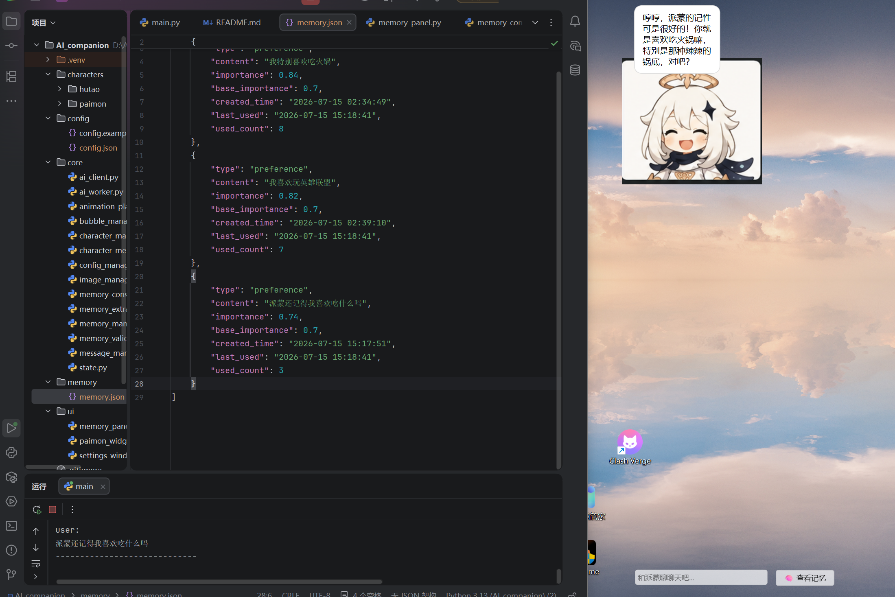
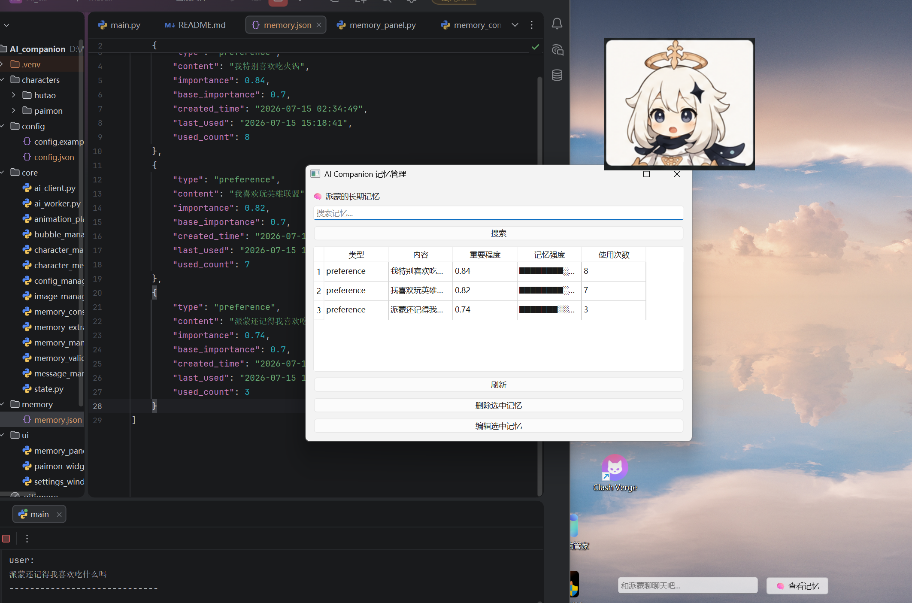

# AI Desktop Companion 🧠✨

基于大语言模型（LLM）的智能桌面陪伴系统。

本项目使用 Python + PySide6 构建桌面 AI Companion，实现了角色人格控制、多角色切换、长期记忆管理以及自然语言交互。

用户可以与桌面角色进行实时对话，系统能够自动提取用户信息并通过记忆检索增强后续对话，实现更加个性化的 AI 陪伴体验。


---

# ✨ Features


## 🤖 LLM智能对话

- 接入 DeepSeek 大语言模型 API
- 支持上下文连续对话
- 基于 System Prompt 实现角色人格控制
- 使用 QThread 实现异步请求，避免阻塞 GUI


## 🧠 长期记忆系统

实现 AI Agent Memory Pipeline：


支持：

- 自动提取用户偏好信息
- 记忆重要程度评分
- 记忆使用次数统计
- 相似信息合并整理
- 根据当前问题检索相关记忆


## 🎭 多角色人格系统

支持多个 AI 角色：

目前：

- 派蒙
- 胡桃


每个角色拥有独立配置：


角色配置包含：

- 人格设定
- System Prompt
- 闲聊内容
- 动画资源


## 🎨 桌面交互系统

实现：

- 桌面悬浮窗口
- 无边框透明窗口
- 角色拖动
- 呼吸动画
- 表情状态切换
- 思考状态动画
- 对话气泡动画
- 打字机效果


## 🗂 Memory Panel

提供可视化记忆管理：

- 查看长期记忆
- 删除记忆
- 编辑记忆
- 搜索记忆
- 查看记忆强度


---

# 🛠 Tech Stack


| 技术 | 用途 |
|-|-|
| Python | 核心开发语言 |
| PySide6 | GUI框架 |
| DeepSeek API | LLM能力 |
| OpenAI SDK | 模型接口调用 |
| JSON | 数据存储 |
| Git | 版本管理 |


---

# 📁 Project Structure


---

# 🚀 Installation


## 1. Install dependencies


```bash
pip install -r requirements.txt
2. Configure API

复制：

config/config.example.json

重命名：

config/config.json

填写 DeepSeek API Key。

3. Run
python main.py
🔮 Future Plans
 向量数据库增强记忆检索
 RAG知识增强
 语音输入输出
 AI视觉感知
 更复杂 Agent 工作流
 更多角色支持
📌 Project Highlights

本项目主要探索：

大语言模型应用开发
AI Agent Memory 架构
人机交互系统设计
桌面端 AI 应用开发
# Demo

## Desktop Companion


## Memory System




## Memory Panel

