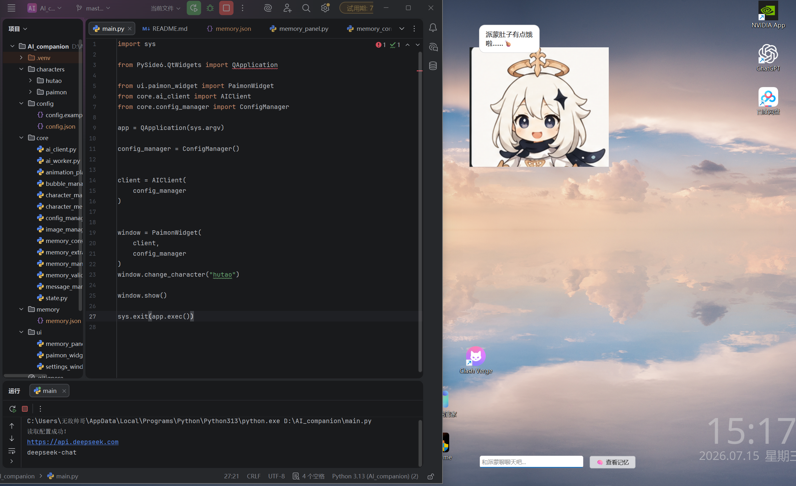
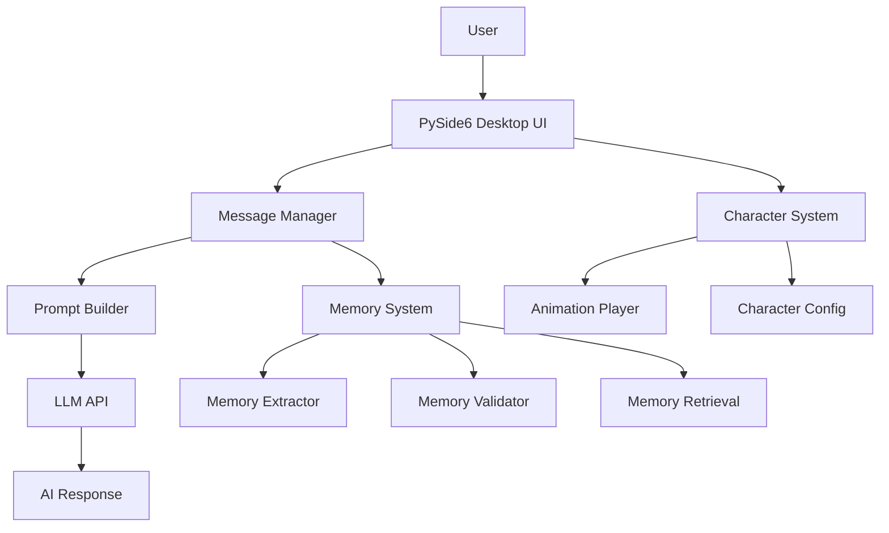

# AI Desktop Companion 🧠✨


## Introduction

AI Desktop Companion 是一个基于 **LLM Agent 架构**的智能桌面陪伴系统。

项目使用 Python + PySide6 构建桌面 AI 应用，
接入大语言模型，实现：

- 角色人格控制
- 多轮自然语言交互
- 长期记忆管理
- 个性化对话增强
- 桌面角色动画交互


系统通过 Memory Pipeline 自动提取用户信息，
结合记忆检索增强后续对话，使 AI 角色能够持续了解用户偏好。


---

# Demo


## AI Companion Demo


## Desktop Companion




## Memory System


## Memory Panel


---

# ✨ Features


## 🤖 LLM Intelligent Conversation

实现基于大语言模型的智能对话：

- 接入 DeepSeek LLM API
- 支持上下文连续对话
- 基于 System Prompt 实现角色人格控制
- 使用 QThread 实现异步请求
- 避免 GUI 阻塞


---

## 🧠 Agent Memory System

实现 AI Agent 长期记忆 Pipeline：


用户输入

↓

Memory Extraction

↓

Memory Validation

↓

Memory Storage

↓

Memory Retrieval

↓

Prompt Augmentation


支持：

- 自动提取用户偏好信息
- 记忆重要程度评分
- 使用次数统计
- 相似信息合并
- 根据当前问题检索相关记忆


---

## 🎭 Multi Character System


支持多个 AI 角色：

目前：

- 派蒙
- 胡桃


每个角色拥有独立配置：

- Personality
- System Prompt
- Idle Messages
- Animation Resources


通过配置文件实现角色扩展。


---

## 🎨 Desktop Interaction System


实现：

- 无边框透明窗口
- 桌面悬浮角色
- 鼠标拖动
- 呼吸动画
- 表情状态切换
- 思考动画
- 对话气泡动画
- 打字机效果


---

## 🗂 Memory Panel


提供可视化记忆管理：

- 查看长期记忆
- 编辑记忆
- 删除记忆
- 搜索记忆
- 查看记忆强度


---

# 🏗 Architecture





---

# 🛠 Tech Stack


| 技术 | 用途 |
|-|-|
| Python | 核心开发语言 |
| PySide6 | Desktop GUI |
| DeepSeek API | LLM能力 |
| OpenAI SDK | 模型接口封装 |
| JSON | 数据存储 |
| QThread | 异步任务处理 |
| Prompt Engineering | 角色人格控制 |
| Agent Memory | 长期记忆架构 |
| Git | 项目版本管理 |


---

# 📁 Project Structure


```
AI_companion

├── main.py

├── core
│
├── ai_client.py
├── ai_worker.py
├── memory_manager.py
├── memory_extractor.py
├── memory_validator.py
├── memory_consolidator.py
├── message_manager.py
├── character_manager.py
└── animation_player.py


├── ui

├── paimon_widget.py
└── memory_panel.py


├── characters

├── paimon
└── hutao


├── config

└── config.example.json


└── requirements.txt
```


---

# 🚀 Installation


## 1. Install dependencies


```bash
pip install -r requirements.txt
```


## 2. Configure API


复制：

```
config/config.example.json
```


重命名：

```
config/config.json
```


填写 DeepSeek API Key。


## 3. Run


```bash
python main.py
```


---

# 🔮 Future Plans


- 使用向量数据库优化长期记忆检索
- 引入 RAG 知识增强
- 增加语音输入输出
- 增加 AI 视觉感知
- 支持更加复杂 Agent Workflow
- 扩展更多角色配置


---

# 📌 Project Highlights


本项目主要探索：

- 大语言模型应用开发
- AI Agent Memory 架构设计
- Prompt Engineering
- 人机交互系统设计
- 桌面端 AI 应用开发

